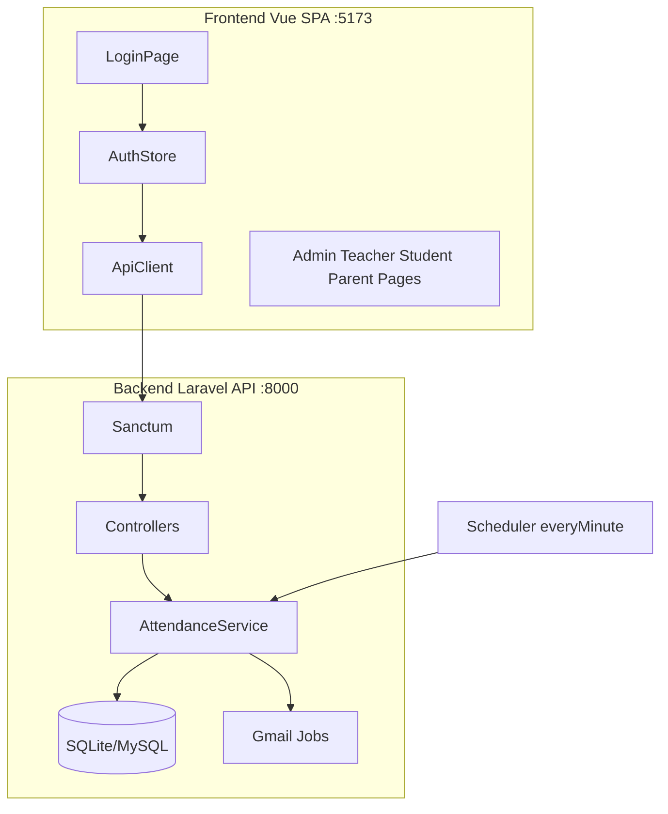

# Developer Guide — GAFS A-Watch

Step-by-step onboarding for developers continuing this project.

## 1. Prerequisites

| Tool | Version |
|------|---------|
| PHP | 8.3+ |
| Composer | 2.x |
| Node.js | 20+ |
| npm | 10+ |
| SQLite | Built-in (or MySQL for production) |

Optional: Git, ngrok/Dev Tunnels for mobile QR testing.

## 2. Clone and install

```bash
git clone <repo-url> gafs-awatch
cd gafs-awatch
```

### Backend

```bash
cd backend
cp .env.example .env
composer install
php artisan key:generate
php artisan migrate --seed
```

### Frontend

```bash
cd frontend
cp .env.example .env
# Set VITE_API_URL=http://localhost:8000
npm install
```

### E2E test tools (optional)

```bash
cd ..   # project root
npm install
npx playwright install chromium
```

## 3. Environment configuration

### Backend `.env`

```env
APP_URL=http://localhost:8000
FRONTEND_URL=http://localhost:5173
SANCTUM_STATEFUL_DOMAINS=localhost:5173

DB_CONNECTION=sqlite   # default, no setup needed
# Or MySQL for production:
# DB_CONNECTION=mysql
# DB_DATABASE=gafs_awatch
```

Gmail (optional for email alerts): see [`GMAIL_SETUP.md`](GMAIL_SETUP.md)

### Frontend `.env`

```env
VITE_API_URL=http://localhost:8000
```

## 4. Run locally (4 terminals)

```bash
# Terminal 1 — API
cd backend && php artisan serve

# Terminal 2 — Frontend
cd frontend && npm run dev

# Terminal 3 — Email queue
cd backend && php artisan queue:work

# Terminal 4 — Scheduler (absent marking)
cd backend && php artisan schedule:work
```

Open http://localhost:5173 and log in with `admin@gafs.edu.ph` / `password`.

## 5. Architecture overview



**Request flow:**
1. Vue page calls `src/api/*.js` function
2. Axios sends request with Bearer token to Laravel
3. Sanctum + RoleMiddleware authenticate and authorize
4. Controller delegates to Service or Eloquent
5. JSON response rendered in Vue component

## 6. Project layout

```
gafs-awatch/
├── backend/           Laravel API
├── frontend/          Vue SPA
├── e2e/               Playwright tests
├── docs/
│   ├── test-data/     Sample JSON + guide
│   ├── user-manual/   Screenshots + videos
│   ├── FRONTEND.md
│   ├── BACKEND.md
│   ├── DATABASE.md
│   └── E2E_TEST_SCENARIOS.md
└── package.json       E2E scripts
```

## 7. Database and test data

Reset to full realistic dataset:

```bash
cd backend
php artisan migrate:fresh --seed
```

This loads [`docs/test-data/sample-data.json`](test-data/sample-data.json) — 17 students, 3 teachers, sessions, and attendance records. See [`docs/test-data/SAMPLE_DATA.md`](test-data/SAMPLE_DATA.md).

## 8. Testing

### E2E (Playwright)

Requires backend + frontend running:

```bash
npm run test:e2e              # All scenarios (auto re-seeds DB)
npm run test:e2e:walkthrough  # User manual videos + screenshots
```

Scenario catalog: [`E2E_TEST_SCENARIOS.md`](E2E_TEST_SCENARIOS.md)

Skip DB reset: `E2E_SKIP_SEED=1 npm run test:e2e`

### Backend unit tests

```bash
cd backend && php artisan test
```

Currently boilerplate only — extend as needed.

## 9. Adding a feature (checklist)

Example: add a new admin report.

1. **Migration** — if new tables/columns needed
2. **Model** — Eloquent model + relationships
3. **Controller** — `app/Http/Controllers/Api/Admin/`
4. **Route** — `routes/api.php` inside admin group
5. **API module** — `frontend/src/api/admin.js`
6. **Page** — `frontend/src/pages/admin/`
7. **Router** — add route + nav item in AdminLayout
8. **E2E test** — add scenario in `e2e/tests/admin.spec.ts`
9. **Docs** — update API_ROUTES.md

## 10. Common tasks

### Add a new student role page

1. Create `frontend/src/pages/student/NewPage.vue`
2. Add route in `router/index.js` with `meta: { role: 'student' }`
3. Add nav link in `StudentLayout.vue`
4. Add API function in `frontend/src/api/student.js`
5. Add controller method + route in backend

### Change attendance rules

Edit `backend/app/Services/AttendanceService.php` → `recordScan()`.

### Configure email alerts

1. Follow [`GMAIL_SETUP.md`](GMAIL_SETUP.md)
2. Ensure `php artisan queue:work` is running
3. Test by scanning a session QR as a student

### Mobile QR testing

Camera requires HTTPS. Options:
- [`DEV_TUNNELS.md`](DEV_TUNNELS.md) — Microsoft Dev Tunnels
- ngrok / mkcert — see [`DEPLOYMENT.md`](DEPLOYMENT.md)

## 11. Deployment

See [`DEPLOYMENT.md`](DEPLOYMENT.md) for XAMPP, production checklist, and HTTPS setup.

Production requirements:
- MySQL database
- Queue worker (supervisor)
- Cron: `* * * * * php artisan schedule:run`
- HTTPS on frontend URL
- Gmail API credentials

## 12. Troubleshooting

| Problem | Solution |
|---------|----------|
| 401 loop after login | Check `SANCTUM_STATEFUL_DOMAINS` and `VITE_API_URL` |
| CORS errors | Verify `FRONTEND_URL` in backend `.env` |
| Camera won't start | Use HTTPS (Dev Tunnels) or localhost exception |
| Emails not sending | Run queue worker; check Gmail credentials |
| Students marked absent incorrectly | Ensure scheduler is running (`schedule:work`) |
| Empty parent dashboard | Verify `parent_student` links in seed data |
| E2E tests fail on scan | Run `migrate:fresh --seed`; check active session token |
| QR scan "not enrolled" | Admin must create teaching assignment + enrollment |

## 13. Documentation index

| Document | Purpose |
|----------|---------|
| [README.md](../README.md) | Quick start |
| [FRONTEND.md](FRONTEND.md) | Vue architecture |
| [BACKEND.md](BACKEND.md) | Laravel API |
| [DATABASE.md](DATABASE.md) | Schema reference |
| [API_ROUTES.md](API_ROUTES.md) | Endpoint list |
| [user-manual/README.md](user-manual/README.md) | End-user guide |
| [test-data/SAMPLE_DATA.md](test-data/SAMPLE_DATA.md) | Test dataset |
| [E2E_TEST_SCENARIOS.md](E2E_TEST_SCENARIOS.md) | Test catalog |
| [DEPLOYMENT.md](DEPLOYMENT.md) | Deploy guide |
| [GMAIL_SETUP.md](GMAIL_SETUP.md) | Email config |

## 14. Code conventions

- **Backend:** PSR-12, Laravel conventions, thin controllers + service classes
- **Frontend:** Vue 3 Composition API (`<script setup>`), Vuetify components
- **API:** REST JSON, Sanctum tokens, role-prefixed routes
- **Commits:** Focused changes; run E2E before merging attendance changes
