# GAFS A-Watch User Manual

Visual guide for administrators, teachers, students, and parents. Screenshots and walkthrough videos live in this folder.

## Quick start

1. Open the app URL (local: http://localhost:5173)
2. Sign in with your role account (password: `password` for test data)
3. You are redirected to your role dashboard automatically

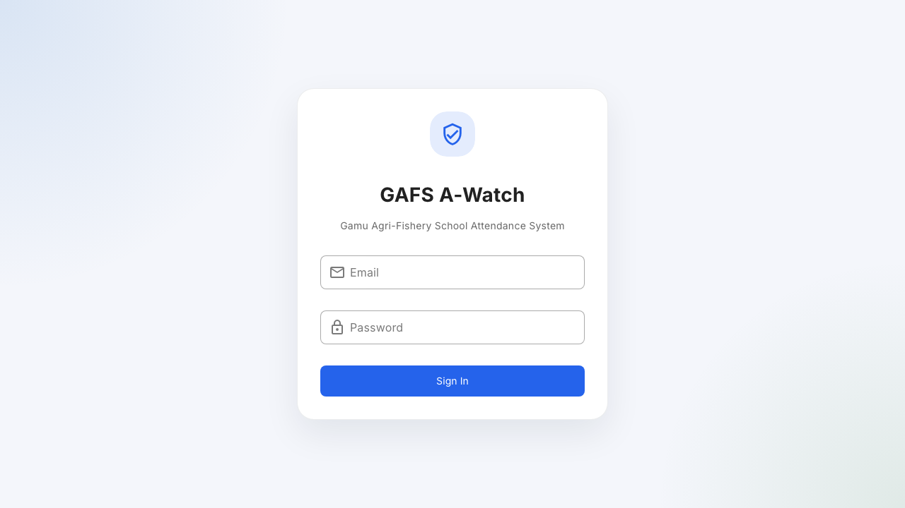

## Demo accounts

| Role | Email | Password |
|------|-------|----------|
| Admin | admin@gafs.edu.ph | password |
| Teacher | teacher@gafs.edu.ph | password |
| Student | student@gafs.edu.ph | password |
| Parent | parent@gafs.edu.ph | password |

Full test dataset: [`../test-data/SAMPLE_DATA.md`](../test-data/SAMPLE_DATA.md)

---

## Admin guide

**Purpose:** Manage school data, enrollments, and attendance reports.

### Dashboard

Overview statistics and charts for school-wide attendance.

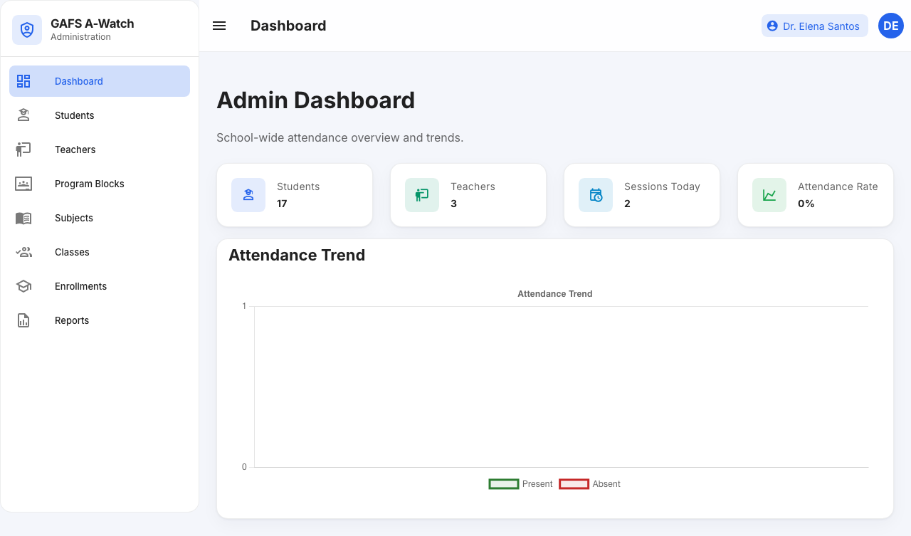

### Students

Create, edit, and delete student records. Each student has a parent email for notifications.

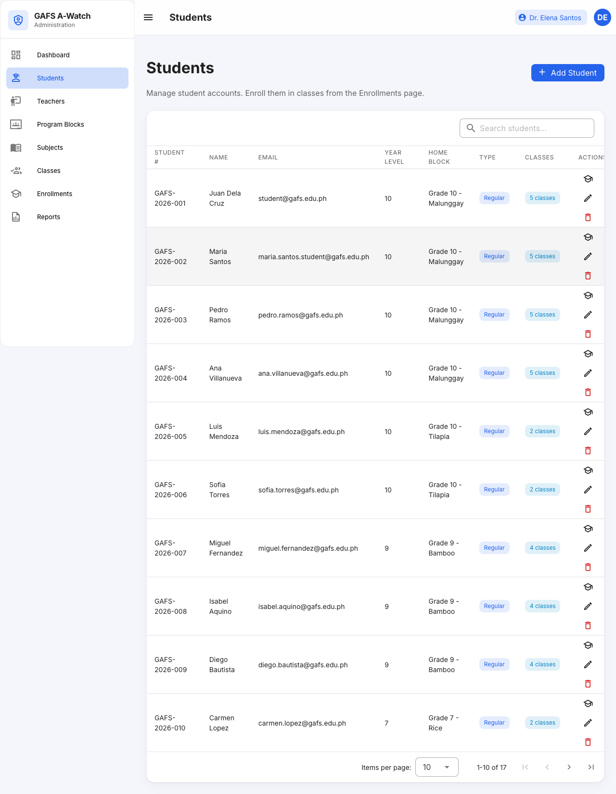

### Teachers, program blocks, subjects

- **Teachers** — staff accounts linked to program blocks
- **Program Blocks** — sections (e.g. Grade 10 - Malunggay)
- **Subjects** — course names (Mathematics, Agri-Fishery Technology, etc.)

### Classes (teaching assignments)

Links a teacher + subject + program block. Required before students can be enrolled in a class.

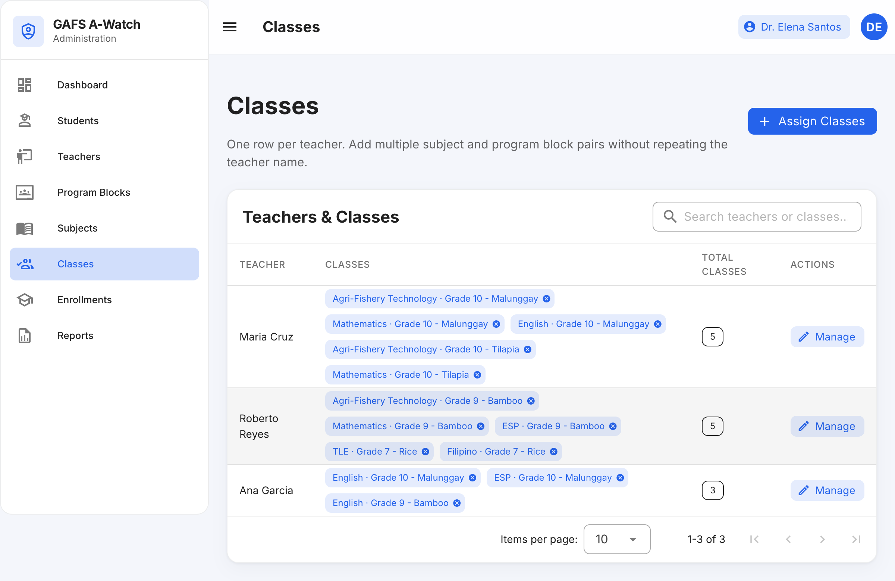

### Enrollments

Assign students to classes. Supports regular (all section classes) and irregular (cross-section) enrollment.

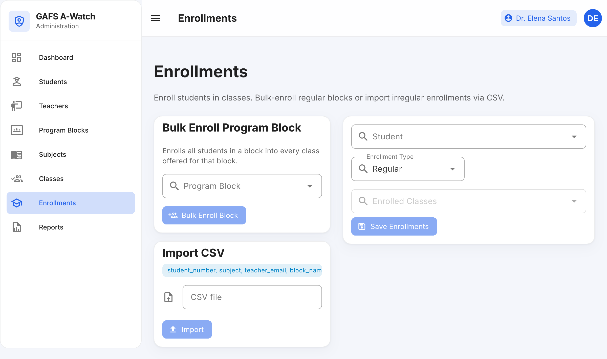

### Reports

Filter attendance by date, section, or subject. Export PDF summaries.

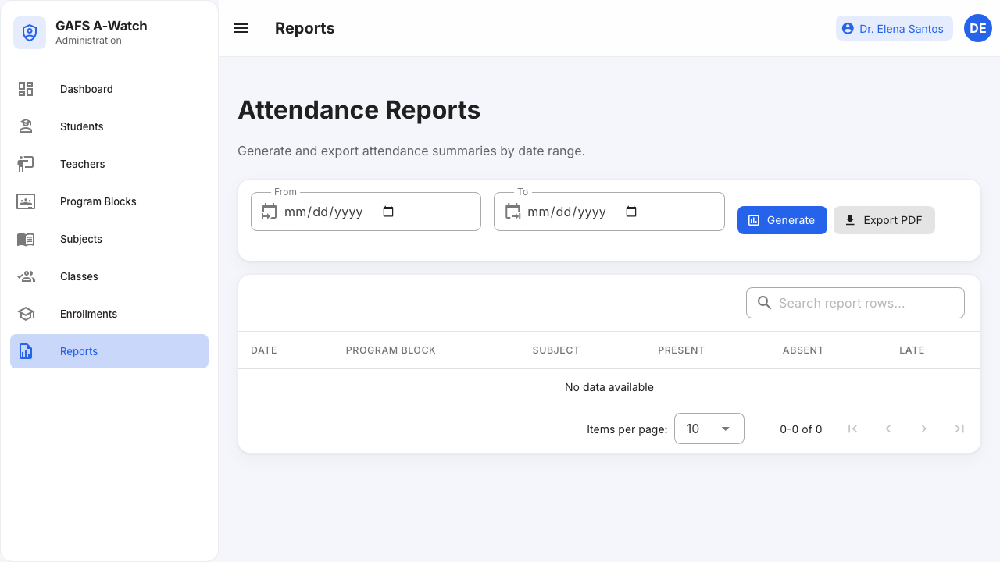

**Video:** [Admin walkthrough](videos/admin-walkthrough.webm) (~3 min — full CRUD on blocks, subjects, teachers, students)

**Narrated:** [Admin walkthrough (with voiceover)](videos/admin-walkthrough-narrated.mp4)

---

## Teacher guide

**Purpose:** Start class sessions, display QR codes, and monitor attendance.

### Dashboard

View your session stats and recent activity.

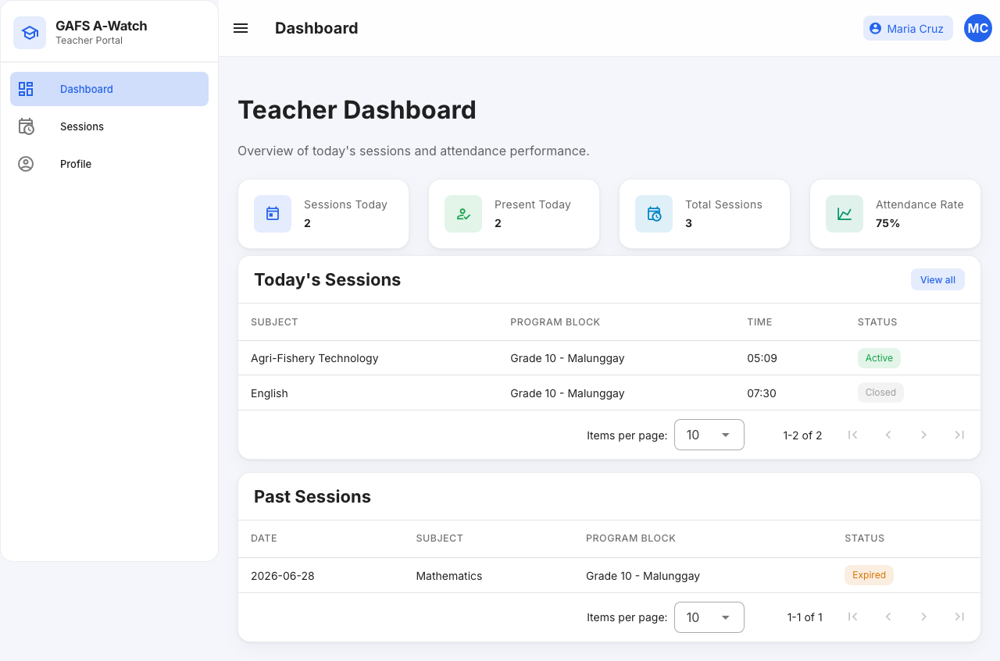

### Class sessions

1. Click **New Session**
2. Select class, date, and time window
3. Click **Start Session**

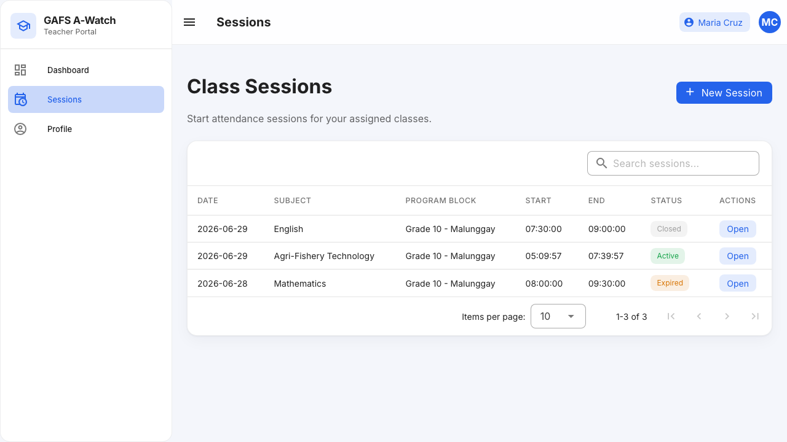

### Session QR code

Open an active session to display the QR code on a projector. Students scan this code with their phones.

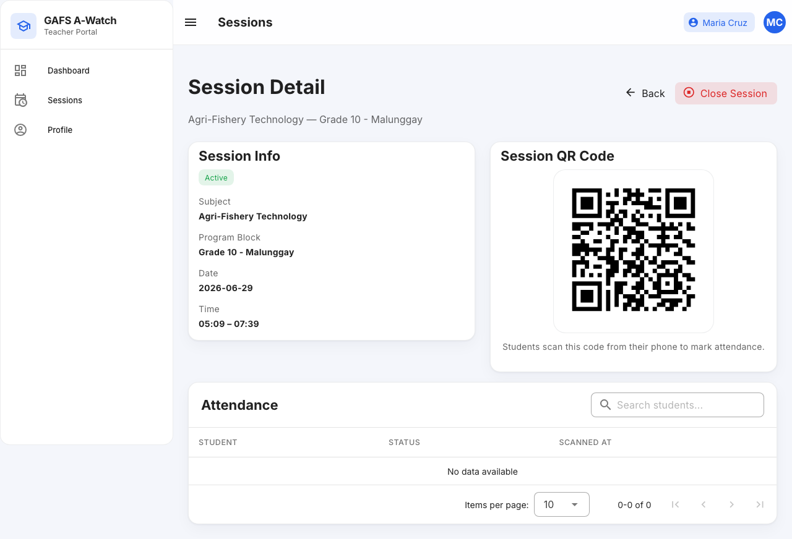

### Close session

Click **Close Session** when class ends. The roster is frozen and the QR code is disabled.

**Video:** [Teacher walkthrough](videos/teacher-walkthrough.webm) (~45 sec — create session, QR, close session)

**Narrated:** [Teacher walkthrough (with voiceover)](videos/teacher-walkthrough-narrated.mp4)

---

## Student guide

**Purpose:** Mark attendance by scanning the teacher's session QR code.

### Dashboard

View your personal attendance history (present, late, absent).

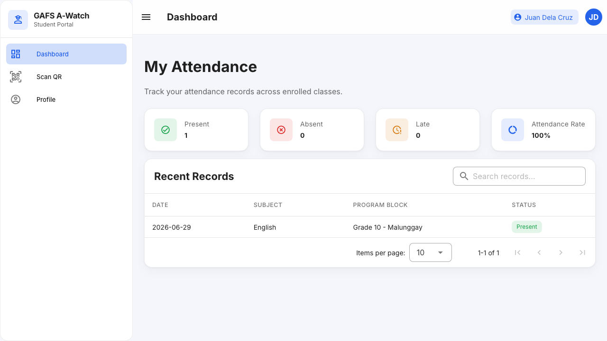

### Scan attendance

1. Go to **Scan Attendance**
2. Allow camera access when prompted
3. Point your phone at the session QR code displayed by your teacher
4. Wait for confirmation, then check your dashboard

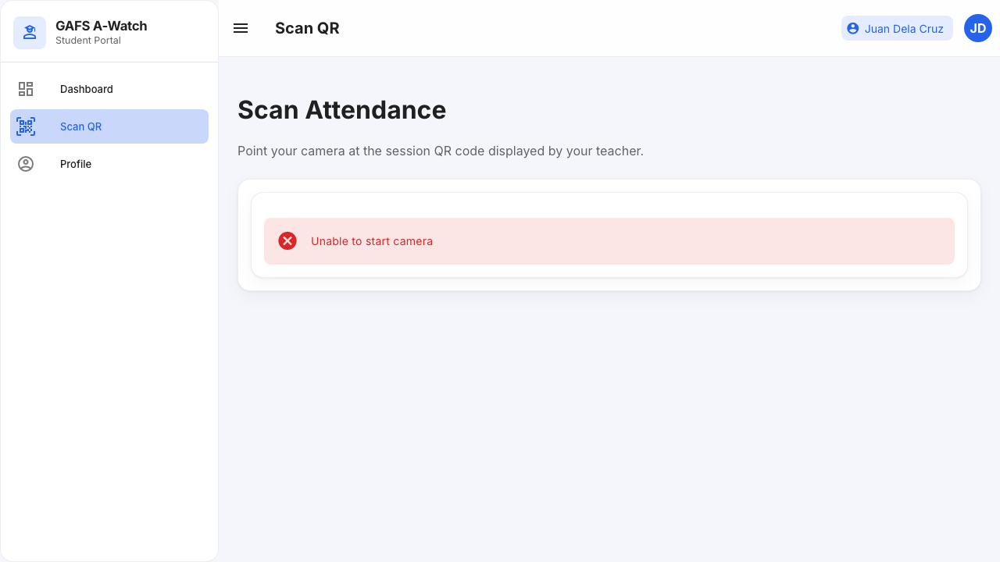

> **Note:** Camera access requires HTTPS in production. Use Dev Tunnels or school HTTPS for mobile testing. See [`../DEV_TUNNELS.md`](../DEV_TUNNELS.md).

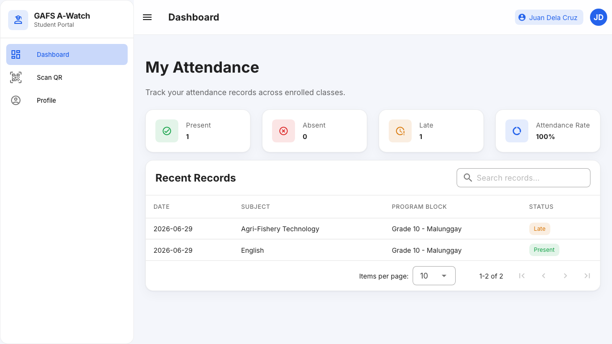

**Video:** [Student walkthrough](videos/student-walkthrough.webm) (~30 sec — dashboard, scan, profile)

**Narrated:** [Student walkthrough (with voiceover)](videos/student-walkthrough-narrated.mp4)

---

## Parent guide

**Purpose:** View linked children's attendance (read-only). Receive email alerts when configured.

### Dashboard

See each child's present, absent, and late counts plus recent session records.

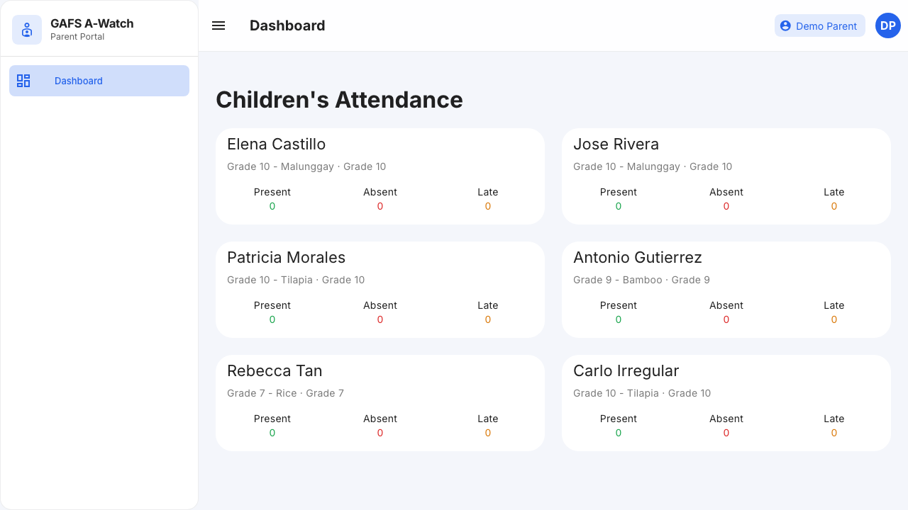

**Video:** [Parent walkthrough](videos/parent-walkthrough.webm) (~15 sec — children attendance)

**Narrated:** [Parent walkthrough (with voiceover)](videos/parent-walkthrough-narrated.mp4)

## Re-record walkthrough videos

```bash
# Backend + frontend must be running
npm run test:e2e:walkthrough
```

Videos are saved to `docs/user-manual/videos/`. Each recording demonstrates **View → Add → Edit → Delete** where applicable, with pauses on every step.

### Narrated walkthroughs (voiceover)

Narration uses macOS `say` (or `espeak-ng` on Linux) plus FFmpeg to merge TTS audio with the screen recording. Requires `ffmpeg` and `ffprobe` on your PATH.

```bash
npm run test:e2e:walkthrough:narrated
```

Outputs:

| File | Description |
|------|-------------|
| `*-walkthrough.webm` | Silent screen recording |
| `*-walkthrough-narrated.mp4` | Same video with synced voiceover |

Narration scripts live in `docs/user-manual/narration/*.json`. Edit step text there and re-run the narrated command to regenerate.

### What each video demonstrates

| Video | CRUD operations shown |
|-------|----------------------|
| **Admin** (~3 min) | Program Blocks, Subjects, Teachers, Students — full add/edit/delete; Classes assign dialog; Enrollments view; Reports generate |
| **Teacher** (~45 sec) | Create session → view QR → close session; profile view |
| **Student** (~30 sec) | Dashboard view; scan page; attendance update; profile view |
| **Parent** (~15 sec) | View linked children's attendance |

---

## Background processes

| Process | What it does |
|---------|--------------|
| Queue worker | Sends Gmail attendance alerts |
| Scheduler | Marks absent students after sessions expire; weekly summary emails |

These must be running on the server. See [`../DEPLOYMENT.md`](../DEPLOYMENT.md).

---

## Related docs

- [E2E test scenarios](../E2E_TEST_SCENARIOS.md)
- [Developer guide](../DEVELOPER_GUIDE.md)
- [Deployment](../DEPLOYMENT.md)
